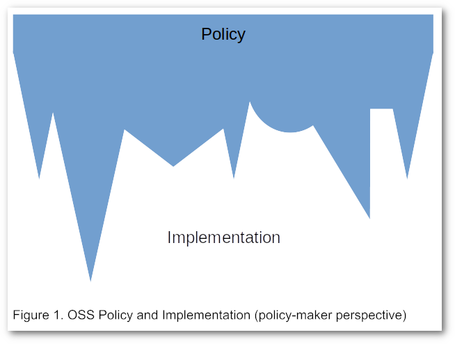
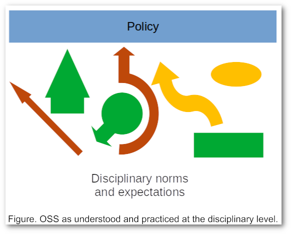
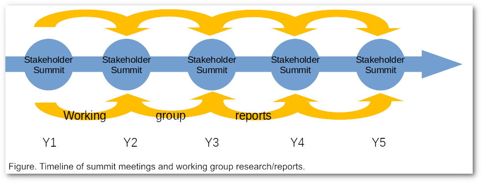

**Open Research Cultures** is a research and knowledge mobilisation network dedicated to the development of an Open-by-Default research culture through training and professional development. The project is a partnership of leading Open Science and Scholarship (OSS) advocacy and training organisations, Research on Research Institutes, Libraries, Universities, and other organisations involved in the study, development, and dissemination of OSS skills and practices. It is led by a global network of OSS researchers, advocates, and thought leaders.

# The Challenge

Open Research Cultures addresses the fundamental gap that exists between Open Research policy, as this is developed and promoted by governments, funders, and knowledge institutions, and Open Research practice, as this is implemented within the community of research users and producers. 

At the policy level, Open Research is commonly understood and promoted as a system-wide public good that manifests itself in different disciplinary shapes. Transnational groups such as the EU, national agencies such as UKRI, Tricouncil (Canada), ARC (Australia), private funders (e.g. Arcadia, Wellcome), and individual institutions (e.g. Simon Fraser, Harvard University, University College London) commonly propose and enforce broad “Open Access” or “Open Data” mandates across their portfolios. REF 2021, for example, will count only research outputs that have been published on an Open basis in its system-wide assessment of research institutions in the United Kingdom, whether in the Humanities and Social Sciences (HSS), or Science, Technology, and Medicine (STEM). Tricouncil, likewise, has introduced system-wide “Open Data” and “Open Access” requirements that apply to researchers seeking funding from any federal funding agency, whether in HSS (SSHRC), Science and Engineering (NSERC), or Health (CIHR). Universities that have adopted the “Harvard Licence” as a way of promoting Open Access and the sustainability of their Institutional Repositories (IRs), apply this licence across their faculties and departments, from Physics to Finance to Fine Arts. While we still have a way to go, the movement towards an Open-by-Default research policy world is nevertheless well in hand.

Things look very different from the perspective of the individual researcher and research user, however. At this level, there is often little evidence of the broad, system-wide consensus upon which so much policy is predicated. Different disciplines, or even sub-disciplines, vary greatly in the degree to which “Open” is promoted, practiced, or even tolerated by researchers, research users, disciplinary societies, and individual departments. In some domains (e.g. High Energy Physics), Open Practices are by far the norm. In others (e.g. History), leading journals and institutions have proved much more reluctant and cautious about supporting Open Research Practices. Some societies (e.g. the American Geophysical Union, the Modern Language Association) are eager supporters of Open Access within their disciplines. Others are more cautious or less supportive of discipline-wide Open Access mandates (for example, see the Society Publishers Coalition responses to Plan S or the Canadian Association of Learned Journals to the redesign of the Aid to Scholarly Journals program).

Above all, however, at the level of practice is the question of training. Where Open Policy is becoming more and more consistent, required, and applicable-to-all, training in Open Research Practices remains a niche activity organised by-and-large on disciplinary lines, delivered by enthusiasts, and generally accessed only by those who are already convinced of its value. Courses in Open Research techniques are, for the most part, delivered outside the regular disciplinary research and professionalisation training provided (implicitly or explicitly) to students, Early Career Researchers, and other other Highly Qualified Personnel as part of their standard traditional training: while some graduate students are no doubt introduced to Open Science and Scholarship as part of their bibliography or methods courses, for example, experience suggests that this is far from the norm in most disciplines and regions. Indeed, students who believe that their future careers require them to know more about OSS research practices than they are learning in their departments are a significant share of the participants in extramural Open Research Cultures at events such as OpenCon and the Force11 Scholarly Communication Institute (FSCI). Such workshops, however — focussed as they are on a single aspect of research practice and attended by those who have a specific interest in learning more about OSS — can never be the primary vectors for promoting the systemic adoption of OSS envisioned in current policy. As long as they continue to “preach to the choir,” “Open” will remain a voluntary and niche activity carried out by the ideologically committed, rather than a fundamental basis for the communication of research results.

# Overall goal and objectives of the proposed partnership

The overall goal of the Open Research Cultures Partnership is to facilitate progress toward a broad-based, Open-by-Default research culture across disciplinary, regional, sectoral, and institutional silos by researching, facilitating the development of, and disseminating best practice in the promotion of, and training and professional development in OSS research practices. 

In addressing this goal, the partnership has three main objectives, which correspond also to our research and mobilisation activities:

1. Improve and facilitate the coordination of current Open Research Training initiatives through a series of summit meetings and working groups examining specific questions of efficiency and effectiveness in current training.
2. Research the pathways by which researchers and research users are currently trained in disciplinary research methods and professionalisation, focussing particularly on the degree to which Open practices are or are not included in such training.
3. Implement the results of (1) and (2) so as to facilitate and promote the adoption of proven training techniques in disciplinary and institutional professionalisation and training programmes.

# Method

Open Research Cultures will address its objectives using a combination of round-tables, summit meetings, and working groups. Interim and final outputs will include 

*   articles, books, and whitepapers reporting on the results of research into the current state and future directions for disciplinary training and professional development in OSS.
*   model syllabi, resources, and instructor training for OSS research methods, both as stand-alone courses or workshops and modules for inclusion in disciplinary training courses.
*   improved coordination and alignment among existing OSS training organisations.

Our approach is based on and extends that taken by the National Academies of Sciences, Engineering, and Medicine in their complementary, Arcadia-funded project, “Roundtable on Aligning Incentives for Open Science” ([http://bit.ly/NASEM-Arcadia](http://bit.ly/NASEM-Arcadia)) and used successful by several members of the Open Research Cultures team on an earlier, Moore and Sloan-funded project, “Principles of the Scholarly Commons.” Where the National Academies project brings together stakeholders from the policy side (e.g. funders, governments, institutional administration, etc.), focussing largely on North America and Western Europe, and is funding research into policy issues involved in the promotion of Open Science, our project proposes using a similar approach to organising and facilitating the much larger and more diverse stakeholders active in the training and implementation space.

The basic structure of the proposed work consists of a series of annual stakeholder summit meetings, held to coincide with the FSCI summer school, at which research and implementation questions are refined and assigned to working groups for investigation.

FSCI is an annual, multi-disciplinary, multi-sector training institute in OSS organised by our partners Force11 and UCLA libraries. Arranging to hold our summit at this annual event is environmentally, economically, and intellectually advantageous: the summer institute is among the most interdisciplinary and largest of OSS training events and attracts instructors and students from a wide variety of disciplines, sectors, regions, and career stages: by coinciding with this event, we are able to reduce our own costs (by using already existing infrastructure) and the number of trips our participants (many of whom offer courses at FSCI) have to make; we also gain access to a large pool of potential users of our material through FSCI’s student body.

In keeping with our model from the National Academies and Principles of the Scholarly Commons, the precise focus and topics of these summits and working groups will be defined ultimately dynamically by the research partners in response to developments in OSS and the results of previous work. As an initial framework, however, our intention is to begin with a proposal for the following sequence of topics and research questions:

1. Landscape analysis: 
    1. Who is interested in OSS and why? How is this interest being manifested?
    2. Who is training (and being trained) in OSS and how? 
    3. What is known about how students, ECR, and HQP are trained in general research methods and professionalisation?
    4. What regional, disciplinary, and other distinctions are there in (1.a), (1.b), and (1.c)
2. Space for cooperation:
    5. Can we improve OSS training by working together? What would an optimal OSS training landscape look like? Where should we not attempt to rationalise or streamline our efforts?
    6. Are there specific audiences (ECR, Librarians, HQP, senior researchers, institutional leaders) we should be concentrating on? Is this the same in every discipline, region, or sector?
    7. Whom can we learn from? What is best practice in OSS training? Who is having the greatest impact?
3. Bringing OSS training to the disciplines:
    8. Can OSS advocates and trainers contribute to improved research skills generally among students, ECR, HQP, and members of the general public?
    9. Are there other groups (Librarians, government, funders, institutional leadership) who could do a better job of putting OSS research techniques in front of students?

In each case, these and similar questions will be developed more fully at the summit meetings and assigned to working groups who will prepare reports, research outputs, training materials and other resources, for the larger group.

# Breadth and engagement of the partner organisations involved

The partner institutions in Open Research Cultures currently comprise of organisations involved in the research or delivery of Open Research Training or Practices. These include many of the most prominent international organisations responsible for delivering courses in Open Science and Scholarship to various audiences (e.g FORCE11, SPARC, the Open Science MOOC, The Carpentries). It also includes two organisations with extensive experience in researching the delivery and promotion of Open Science (e.g. COKI). And finally it includes a number of institutions and organisations who are interested in the promotion and delivery of Open Research Practices at an institutional or disciplinary level (e.g. AGU, MLA, UCLA Libraries, University of Lethbridge). As a project to bridge the current gaps among these different organisations, Open Research Cultures provides a forum by which these organisations can leverage their current work in this area, discovering best practice, improving their knowledge of activities by others, and discovering efficiencies or complementary practices. # How does my Institution, Group, or Project join Open Research Cultures?

Open Research Cultures welcomes expressions of interest from institutions and organisations active in the development or promotion of Open Research Practices. Partners join Open Research Cultures through a negotiated letter of agreement indicating how participation fits with their current or planned activities and strategic priorities in Open Research and the resources and activities they bring to the network. Partners participate in the overall design and governance of the Partnership and benefit from opportunities to leverage their contributions through joint action and access to supplementary funding.

# Can I join as an individual?

Individuals participate in Open Research Cultures through their institutions, by joining the current leadership team, or, assuming the project is funded, participating in its activities. Depending on the timing and level of this participation, individuals may be required to register with SSHRC and provide a CV. 

# Contact
For further details or to inquire about joining Open Research Cultures, please contact the project director 
Daniel Paul O’Donnell [daniel.odonnell@uleth.ca](mailto:daniel.odonnell@uleth.ca)
Director, Open Research Cultures http://OpenResearchCulture.org
Centre for the Study of Scholarly Communication and Department of English
University of Lethbridge
Canada T1K 3M4
